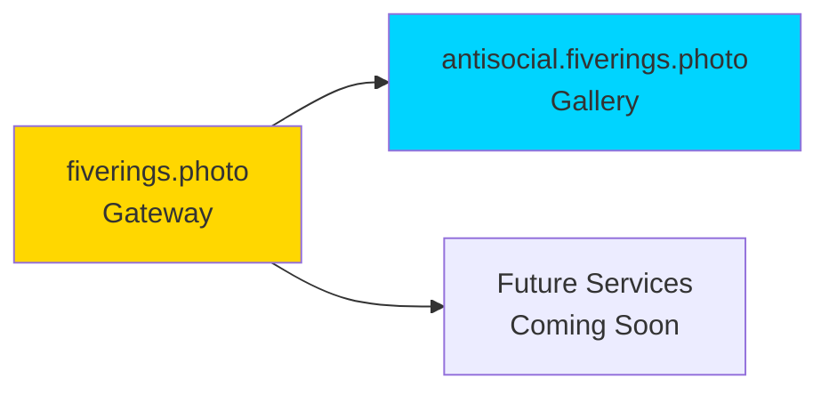

# Domain Architecture - Five Rings Photography

**Date**: 2025-08-16  
**Updated**: 2025-08-16 (Post SSL Fix)  
**Purpose**: Document complete domain architecture and relationships  
**Status**: ✅ Both domains operational with SSL  

## Domain Structure

### Primary Domain
- **Domain**: fiverings.photo
- **Purpose**: Professional services gateway
- **Current State**: Strategic landing page (live)
- **Hosting**: GitHub Pages (workflow deployment)
- **Repository**: jur1st/fiverings-photo
- **Technology**: Static HTML (React/Next.js ready)

### Subdomain (This Repository)
- **Domain**: antisocial.fiverings.photo
- **Purpose**: Photography exhibition gallery
- **Current State**: Fully operational
- **Platform**: Hugo static site generator
- **Repository**: jur1st/antisocial-fiverings-photo
- **Theme**: Flynn (Tron aesthetic) - Locked

## SSL Configuration

### Certificate Provider
- **Provider**: GitHub Pages (Let's Encrypt)
- **Type**: Automatic SSL/TLS
- **Renewal**: Automatic via GitHub Pages
- **Verification**: HTTP-01 challenge

### DNS Configuration Required
For fiverings.photo to work with GitHub Pages SSL:

1. **A Records** (point to GitHub Pages servers):
   - 185.199.108.153
   - 185.199.109.153
   - 185.199.110.153
   - 185.199.111.153

2. **CNAME Record** (if using www):
   - www.fiverings.photo → jur1st.github.io

## Redirect Implementation

### Method
HTML meta refresh (0 second delay)

### Rationale
- Simple and reliable
- No JavaScript required
- Works with GitHub Pages
- Maintains SEO value via canonical link

### Code
```html
<meta http-equiv="refresh" content="0; url=https://antisocial.fiverings.photo">
<link rel="canonical" href="https://antisocial.fiverings.photo">
```

## GitHub Pages Configuration

### Repository Settings
1. Navigate to Settings → Pages
2. Source: Deploy from branch
3. Branch: `fix/ssl-placeholder` (temporarily) then `main`
4. Folder: / (root)
5. Custom domain: fiverings.photo
6. Enforce HTTPS: ✓ Enabled

### File Structure
```
/
├── index.html    # Redirect placeholder
├── CNAME         # Domain configuration
└── DOMAIN-ARCHITECTURE.md  # This documentation
```

## Deployment Process

1. **Create Branch**: `fix/ssl-placeholder`
2. **Add Files**: index.html, CNAME
3. **Push to GitHub**: Triggers GitHub Pages build
4. **DNS Propagation**: May take up to 24 hours
5. **SSL Provisioning**: Automatic after DNS verified
6. **Merge to Main**: After validation

## Testing Checklist

- [ ] fiverings.photo loads without SSL warnings
- [ ] Automatic redirect to antisocial.fiverings.photo
- [ ] Mobile responsive placeholder
- [ ] All major browsers tested
- [ ] DNS properly configured
- [ ] SSL certificate valid

## Future Considerations

When ready to deploy full site to fiverings.photo:
1. Remove redirect from index.html
2. Deploy full Hugo build
3. Update DNS if needed
4. Maintain SSL continuity

## Critical Lessons Learned

### GitHub Actions Workflow Deployment
When using GitHub Actions (not branch deployment):
1. **CNAME file doesn't auto-configure domain**
2. **Must use API to set custom domain**:
   ```bash
   gh api --method PUT repos/jur1st/[repo]/pages \
     --field cname="domain.com"
   ```
3. **This applies to BOTH repositories**

## Relationship Between Domains



## Troubleshooting

### SSL Certificate Errors
1. **Check custom domain is set** (not just CNAME file)
2. Use API command above to set domain
3. Verify DNS A records point to GitHub
4. Wait 10-30 minutes for provisioning

### Custom Domain Shows Null
- This is THE most common issue with workflow deployment
- Solution: Use gh api command to set domain
- Trigger rebuild after setting

---

**Status**: ✅ Fully Operational  
**Main Domain**: https://fiverings.photo  
**Gallery**: https://antisocial.fiverings.photo  
**Infrastructure**: Complete and documented